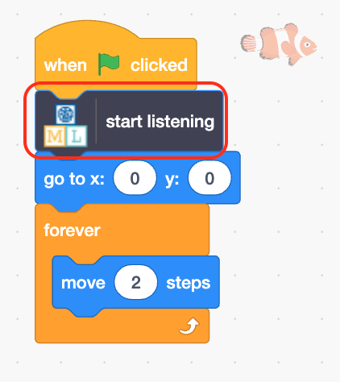
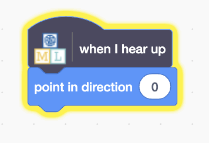

## Move the fish

Now that your model can distinguish between words, you can use it in a Scratch program to move a fish around the screen.

--- task ---
+ Click on the **< Back to project** link.

+ Click on **Make**.

+ Click on **Scratch 3**.

+ Click on **Open in Scratch 3**.

--- /task ---

--- task ---
+ Click on **Project templates** at the top and select the 'Fish food' project to load the fish sprite which has some code already added to it. 

**[FOR QA ONLY: Use the fish-food-starter.sb3 file in resources folder]**

--- /task ---

Machine Learning for Kids has added some special blocks to Scratch to allow you to use the model you just trained. Find them at the bottom of the blocks list.

--- task ---

+ With the **Fish** sprite selected, click on the **Code** tab. Find the right place in the code and add a special block to tell the model to start listening. 

--- /task ---

--- task ---

+ Add the code for 'up' to the **Fish** sprite. 

--- /task ---

--- task ---

+ Look at the code you have to move the fish up, then see if you can work out the code for down, left and right.

--- collapse ---
---
title: Show me how
---

--- /collapse ---

--- /task ---

--- task ---
+ Click the **green flag** and say up, down, left or right. Check that the fish moves in the direction you expected. 

--- /task ---

